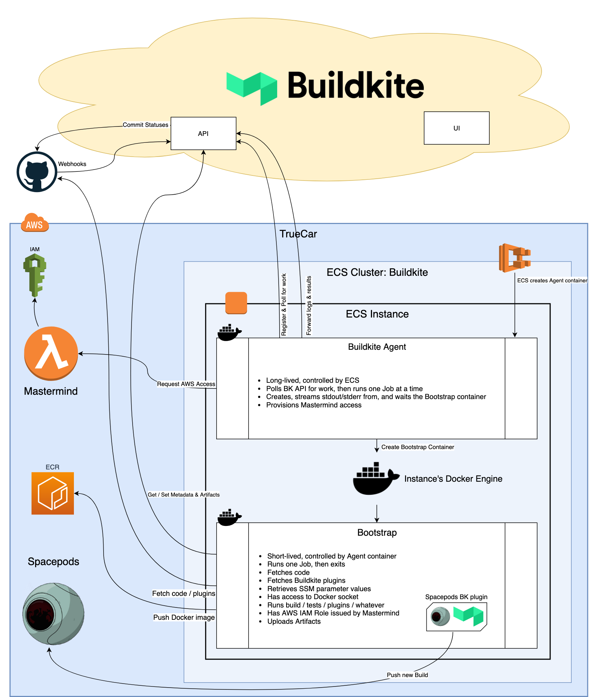

# docker/buildkite


This is a Docker image which runs the Buildkite agent and also the builds themselves.


## What do I need to know to start building?

- Okta/SSO setup is pending. For now, someone with access to our account will have to invite you to sign up by email. Ask in #guild-cicd or ask @rlong for an invite.
- Our org is <https://buildkite.com/truecar>
- There are really great Docs at <https://buildkite.com/docs/> -- good place to start

- abp-frontend is pretty close to fully implemented, maybe some issues with Cypress jobs
- abp-backend is pretty close to fully implemented, could use some optimization/parallelization of Test job
- [some data-eng jobs](https://buildkite.com/truecar?team=data-engineering) (`listings`, `image-processor`, `build-data-processor`, `vin-decoder`) are implemented, the Maven build at least seems to work
    - vin-decoder builds fine and its Docker image has been deployed successfully, at least
    - Maven / Artifactory uploads might not be happening correctly

- Buildkite will push Github statuses automatically as the build runs.
    - Can be configured to set a single per-Build status or separate statuses for each step in the Pipeline

- The following CLI tools are available in the based build image:
    - `buildkite-agent`
    - `docker`
    - `docker-compose`
    - `aws`
    - `jq`
    - `git` (and `git-lfs`)
    - `curl`
    - `gpg`
    - `python`
    - See the [Buildkite image Dockerfile](https://git.corp.tc/docker/buildkite/blob/master/Dockerfile) for more info

- Docker access is available to all builds by default, just as you'd expect; no need to ask for it or do anything special.

    - **A major caveat: mounting volumes is not so straightforward.**

        Because the builds themselves are running in Docker containers, the usual problems associated with filesystem mapping come into play. For the most part, paths under `/buildkite` _should_ be the same inside and outside the build container, so that e.g. the buildkite-docker plugin works as expected to mount the code checkout path.

- When building with Docker, it is recommended to define a `docker-compose.yml` and use the [docker-compose plugin](https://github.com/buildkite-plugins/docker-compose-buildkite-plugin/) as it handles a lot of work automatically.

- Customized behaviours:
    - You can access AWS SSM parameters ("Parameter Store") by assigning them to Env vars like so:

        ```yaml
        - command: foo
          env:
            MY_VAR: ssm-parameter:/path/to/your/parameter
        ```

        This will be replaced as each Job starts by the ["global `environment` hook" which is defined in the Buildkite agent container](https://git.corp.tc/docker/buildkite/blob/master/buildkite/hooks/environment.py).

        The same pattern allows easy access to Buildkite build Meta Data:

        ```yaml
        - command: foo
          env:
            MY_VAR: buildkite-meta-data:some-key-that-was-previously-set
        ```

        Both of these will print **warnings** (ie. they won't fail the build automatically) if the given path/key can't be resolved, doesn't have a value, or any other error occurs. These warnings are clearly indicated in the `Running global environment hook` section of any given Job

    - All builds currently run in the `build` account, on a separate ECS cluster.
        - ECS manages a fleet of long-lived Agent containers
        - Each Agent will run a single job at a time, and has Tags and a Queue, similar to a Sidekiq worker. The API makes work available on a Queue and one of the Agents grabs it.
        - Your build Job actually runs in a separate container called the Bootstrap container. This runs the same Docker image as the Agent (and in the same cgroup) but is isolated from the agent.

    - AWS Access:
        - Builds are automatically granted [some minimal access](https://git.corp.tc/docker/buildkite/blob/87b4306/pylib/buildkite/mastermind.py#L90-L151) to AWS resources for the essentials:
            - ECR (Docker registry) push/pull
            - SSM parameter reads
            - Invoking the `build-numbers` Lambda (used by `codebuild-helper`)
            - Read/Write access to the `tc-build-scratch` S3 bucket

        - Additional access can be requested via Mastermind. Provide a Mastermind "aws-access.json" file describing the access you need, then set the env var `MASTERMIND_ACCESS_DOCUMENT_PATH` to the relative path to that file. Mastermind will then function just like it does for Spacepods: It will provide your build Job with credentials that let you assume an IAM Role that provides the access needed.
            - There's a plugin that will assume that role for you [cultureamp/aws-assume-role](https://github.com/cultureamp/aws-assume-role-buildkite-plugin).
            - See [infra/ami-builder pipeline.yml](https://git.corp.tc/infra/ami-builder/blob/master/.buildkite/pipeline.yml#L41) for an example using `aws-access.json` and that plugin.

    - We have [a Buildkite plugin for uploading builds to Spacepods](https://git.corp.tc/infra/spacepods-buildkite-plugin)
    - Feel free to use and/or create any other plugins you may need. The intention is that plugins are fully supported in our implementation.

- Spacepods CI/CD & Gatekeeper integration is not yet implemented, so builds will trigger via Github hooks but the CI side of things doesn't happen via Buildkite yet

# Architecture Overview


